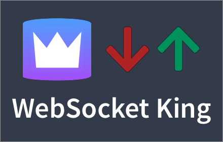

# Websocket King

- sometimes window is not pickedup on refresh\
- migrations

## About

WebSocket King is a a tool designed to assist in developing and debugging WebSocket connections.

- Website - https://websocketking.com
- Chrome Extension - https://chrome.google.com/webstore/detail/cbcbkhdmedgianpaifchdaddpnmgnknn

## Development

1. Clone project
2. `cp .env.dev.example .env.dev`
3. `yarn start`

## Production

### `yarn build:chrome`

Builds the app for production (Chrome Extension) to the `build` folder. 
It correctly bundles React in production mode and optimizes the build for the best performance.

### `yarn build:web`

Builds the app for production (web) to the `build` folder. 
It correctly bundles React in production mode and optimizes the build for the best performance.

### `yarn build:electron`

BETA. Builds the app for production (Electron) to the `build` folder. 
It correctly bundles React in production mode and optimizes the build for the best performance.

### `yarn eject`

**Note: this is a one-way operation. Once you `eject`, you can’t go back!**

If you aren’t satisfied with the build tool and configuration choices, you can `eject` at any time. This command will remove the single build dependency from your project.

Instead, it will copy all the configuration files and the transitive dependencies (Webpack, Babel, ESLint, etc) right into your project so you have full control over them. All of the commands except `eject` will still work, but they will point to the copied scripts so you can tweak them. At this point you’re on your own.

You don’t have to ever use `eject`. The curated feature set is suitable for small and middle deployments, and you shouldn’t feel obligated to use this feature. However we understand that this tool wouldn’t be useful if you couldn’t customize it when you are ready for it.
